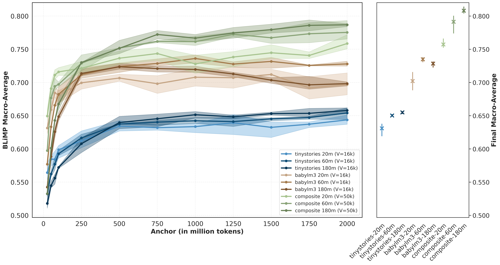
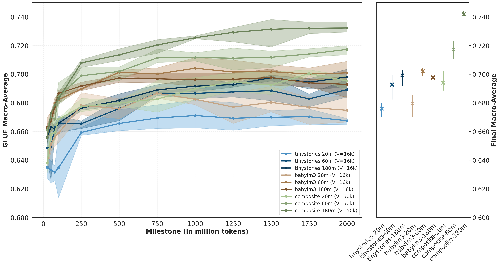
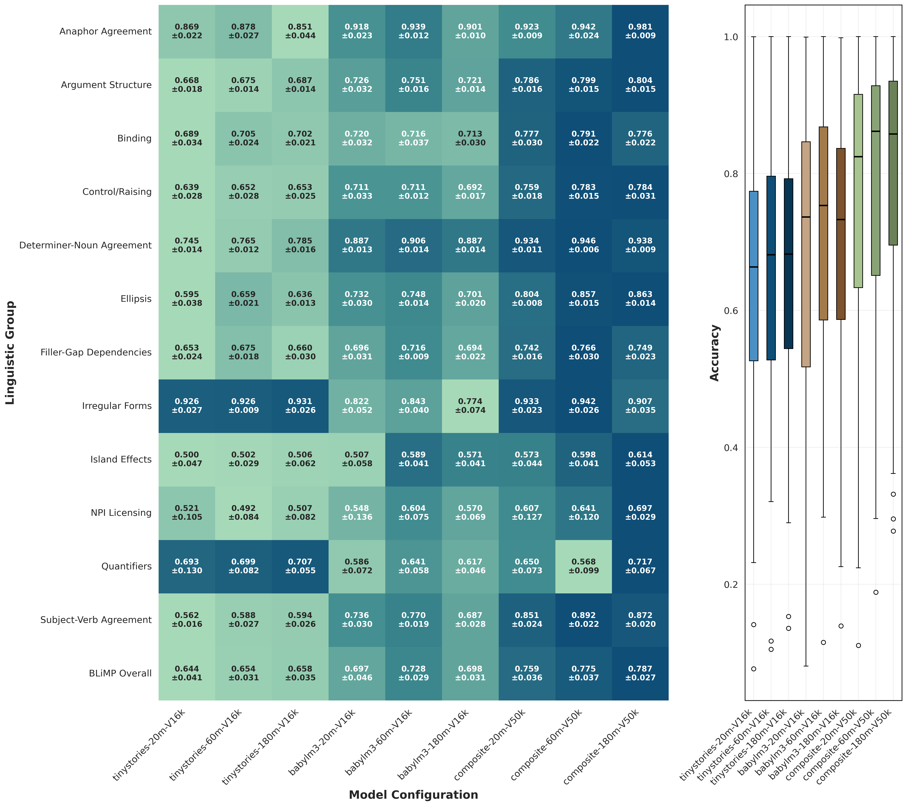
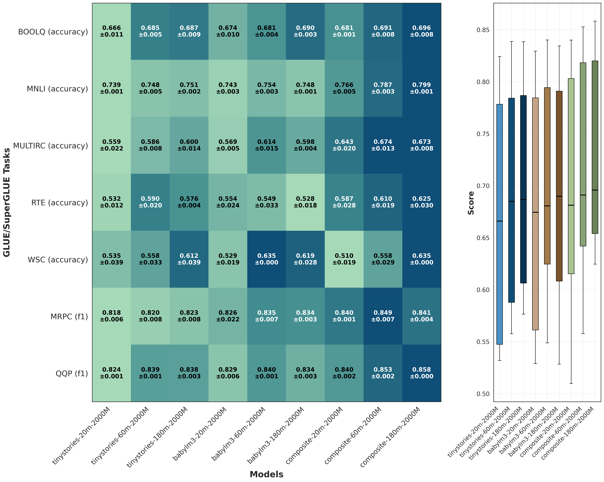
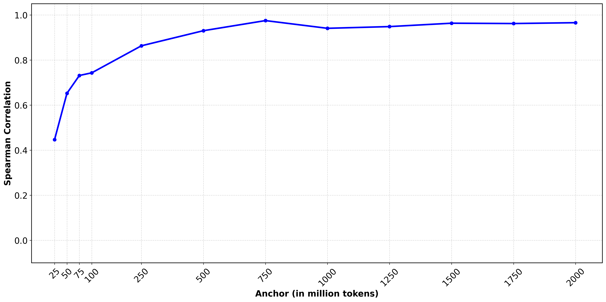

<section class="hero">
  <h1>Efficiency in Language Model Pre-training</h1>
  
Learning Curves Across Datasets and Model Sizes

  
Andreas Paraskeva · Max Johannes van Duijn · Maarten de Rijke · Suzan Verberne · Jan N. van Rijn

  

    <a href="./Data_efficiency_in_language_model_pre_training___DMRLR.pdf">Paper (PDF)</a>
    <a href="https://github.com/andreasparaskeva/lm-efficient-analysis">Code</a>
    <a href="https://huggingface.co/collections/paraskeva/lm-efficiency-analysis">Model Collection</a>
  

</section>

<section class="panel">
  

    Training large language models is compute- and data-intensive, limiting optimisation in
    resource-constrained settings and increasing environmental impact. In this work, we
    investigate how dataset composition, model size, and training budget interact during
    small-scale pre-training of decoder-only transformers.
    We train LLaMA-based models of three sizes (20M, 60M, and 180M parameters) on three
    curated datasets: TinyStories, BabyLM, and a composite English corpus constructed from
    diverse open-domain sources. Using token-based anchors ranging from 25M to 2B tokens,
    we derive learning curves and evaluate both formal and functional linguistic competence.
    Formal competence is measured with BLiMP, and functional competence, defined as
    natural language understanding (NLU), is evaluated on a subset of GLUE and SuperGLUE.
    The experimental grid results in 351 evaluated model instances.
  

  

    Although small relative to current large-scale systems, these models allow controlled
    analysis of pre-training dynamics under explicit compute constraints.
  

  

    

      
Models

      
20M / 60M / 180M

    

    

      
Datasets

      
TinyStories · BabyLM · Composite Corpus

    

    

      
Token Anchors

      
25M–2B tokens

    

    

      
Evaluated Instances

      
351

    

  

</section>

<section class="panel">
  <h2>Finding 1: Dataset Selection Strongly Influences Performance</h2>
  

    We find that dataset selection strongly influences model performance.
    Models trained on the composite corpus consistently outperform those trained on
    BabyLM and TinyStories. This relative ordering is already observable early during
    pre-training and remains stable throughout training.
    In several cases, a smaller model trained on a structurally richer corpus outperforms a
    larger model trained on a more limited one. Early anchor performance appears
    representative of converged behaviour, suggesting that compute-aware model
    comparison can be supported by early-stage evaluation.
  

  

    <figure>
      
      <figcaption>
        BLiMP learning curves across token-based anchors. Curves group by dataset rather
        than model size, and the relative ordering stabilises within early anchors, indicating
        that dataset composition drives formal linguistic competence.
      </figcaption>
    </figure>
    <figure>
      
      <figcaption>
        GLUE and SuperGLUE macro-average learning curves. The same dataset-driven
        ordering is observed for NLU, although separation is less pronounced than for BLiMP.
      </figcaption>
    </figure>
  

</section>

<section class="panel">
  <h2>Finding 2: Scaling Gains Depend on Data Diversity</h2>
  

    The effect of model scaling is dataset dependent. For the composite corpus, larger
    models yield consistent improvements across anchors. For BabyLM, scaling gains are
    weaker and occasionally unstable, and for TinyStories they are limited. In both BLiMP
    and downstream heatmaps, richer-data settings present an upward shift in mean scores
    together with a reduced interquartile range (IQR), indicating more uniform performance
    across linguistic groups and tasks. These results suggest that additional model parameters are
    most effectively utilised when paired with sufficient structural and lexical diversity.
  

  

    <figure>
      
      <figcaption>
        BLiMP performance across linguistic groups at 2B tokens. Richer corpora show
        higher accuracy and reduced IQR, reflecting more stable performance across linguistic phenomena.
      </figcaption>
    </figure>
    <figure>
      
      <figcaption>
        GLUE and SuperGLUE task-level performance at 2B tokens. Clear scaling benefits
        are observed primarily for models trained on the composite corpus.
      </figcaption>
    </figure>
  

</section>

<section class="panel">
  <h2>Finding 3: Early Anchors Predict Final Model Ranking</h2>
  

    Early-anchor evaluations are strongly predictive of final behaviour, supporting
    compute-efficient early model discarding. Model rankings stabilise quickly across
    anchors, making early checkpoints useful for screening model-dataset combinations.
    By 250M tokens, Spearman rank correlation already exceeds 0.85, indicating that
    relative model ordering is largely established.
  

  

    <figure>
      
      <figcaption>
        BLiMP learning curves across token-based anchors. Dataset-level ordering emerges
        early and remains stable, suggesting early checkpoints already capture final trends.
      </figcaption>
    </figure>
    <figure>
      
      <figcaption>
        Spearman rank correlation between early-anchor and final BLiMP performance.
        High correlation at early anchors provides statistical evidence that ranking is stable well before convergence.
      </figcaption>
    </figure>
  

</section>

<section class="panel">
  <h2>Reproducibility</h2>
  <ul>
    <li>Pre-training and (upcoming)fine-tuning code</li>
    <li>Token-based checkpointing framework</li>
    <li>Model weights, logs, and learning curves</li>
  </ul>
  

    Repository:
    <a href="https://github.com/andreasparaskeva/lm-efficient-analysis">
      github.com/andreasparaskeva/lm-efficient-analysis
    </a>
  

</section>

<section class="panel">
  <h2>Citation</h2>
  <pre><code>@article{paraskeva2026efficiency,
  title={Efficiency in Language Model Pre-training: Learning Curves Across Datasets and Model Sizes},
  author={Paraskeva, Andreas and van Duijn, Max Johannes and de Rijke, Maarten and Verberne, Suzan and van Rijn, Jan N.},
  year={2026}
}</code></pre>
</section>
